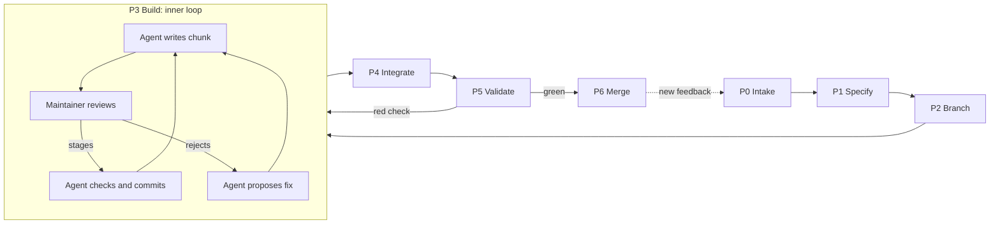

# Human-Gated Flow (HuG Flow)

| Field   | Value           |
| ------- | --------------- |
| Status  | Draft           |
| Version | 0.1.0           |
| Author  | Julien Béranger |
| Created | 2026-09-25      |
| License | MIT             |

## Abstract

HuG Flow is an issue-driven development lifecycle in which a coding agent executes every process step and a human maintainer approves every chunk of content by staging it in the Git index. This document specifies the roles, artifacts, phases, approval points and invariants of the flow. It does not prescribe tools. Two example setups built on Claude Code and GitHub are provided: a generic one to adapt, in [`examples/minimal`](../examples/minimal/README.md), and a personal one, in [`examples/julien`](../examples/julien/README.md).

## 1. Purpose

The Human-Gated Flow (HuG Flow) is a development lifecycle for building software with a coding agent. It extends the [GitHub Flow](https://docs.github.com/en/get-started/using-github/github-flow), first described by [Scott Chacon](http://scottchacon.com/2011/08/31/github-flow.html) in 2011, with an explicit division of labor between a human maintainer and an AI agent.

The key words MUST, MUST NOT, SHOULD and MAY are to be interpreted as described in [RFC 2119](https://www.rfc-editor.org/rfc/rfc2119).

## 2. Scope

HuG Flow applies to projects that meet three conditions:

- the deliverable is conventional software, whose behavior is validated by deterministic checks (format, lint, tests, build);
- the code is hosted on [GitHub](https://github.com/) and changes reach the default branch only through pull requests;
- a coding agent writes most of the code, and a human is accountable for everything that is merged.

HuG Flow is independent of the operating system. Every step relies on Git and the forge's command-line client, so the flow runs the same on macOS, Linux and Windows.

HuG Flow does not cover how to build an agent, how to deploy, or how to monitor in production. Section 9 explains how these relate to the Agent Development Lifecycle (ADLC).

## 3. Design principles

1. **Process autonomy, content control.** The agent runs the whole workflow (issue, branch, push, pull request, merge) without asking permission. It never decides alone what enters the history.
2. **Approval by staging.** In [Git](https://git-scm.com/), the staging area is the approval surface: staging a change means approving it.
3. **Cheap failure.** A branch costs nothing, so experiments are encouraged. A failed attempt is closed and deleted with no effect on `main`.
4. **End-to-end traceability.** Every change links back to an issue (the _why_). The commits record the _how_, and the pull request records the _discussion_.
5. **Validation before integration.** Checks run before code reaches `main`, never after.

## 4. Roles

| Role           | Held by                                              | Responsibilities                                                                                                                           |
| -------------- | ---------------------------------------------------- | ------------------------------------------------------------------------------------------------------------------------------------------ |
| **Maintainer** | Human                                                | Confirms task specs, reviews and stages every chunk written by the agent, answers review questions, is the sole author of record           |
| **Agent**      | [Claude Code](https://code.claude.com/docs)          | Restates tasks as specs, writes code in reviewable chunks, runs the local check pipeline, commits what was staged, runs every process step |
| **CI**         | [GitHub Actions](https://docs.github.com/en/actions) | Runs the full test suite, typecheck and build on every push to a pull request                                                              |
| **Reporter**   | Users, staff                                         | Supply feedback that becomes issues                                                                                                        |

The authorship rule is symmetric. Whoever did not write a chunk approves it by staging it, and the author then commits exactly what was staged.

## 5. Artifacts

| Artifact                | Created in phase | Purpose                                                                                                 |
| ----------------------- | ---------------- | ------------------------------------------------------------------------------------------------------- |
| Issue                   | P1               | States what, why, and what "done" looks like                                                            |
| Branch `<n>-<slug>`     | P2               | Isolates the work, linked to issue `#n`                                                                 |
| Chunk                   | P3               | One logical, reviewable unit of change, left unstaged                                                   |
| Commit                  | P3               | One approved chunk, lowercase imperative title                                                          |
| Pull request            | P4               | Discussion space, CI trigger, closes the issue on merge                                                 |
| `CHANGELOG.md` entry    | P4               | One summary per pull request, in [Keep a Changelog](https://keepachangelog.com/en/1.1.0/) format        |
| Squash commit on `main` | P6               | One line of history per feature                                                                         |
| `CLAUDE.md`             | Setup            | Persistent instructions that encode this specification ([docs](https://code.claude.com/docs/en/memory)) |
| Skills                  | Setup            | Reusable procedures such as feedback intake ([docs](https://code.claude.com/docs/en/skills))            |

## 6. Lifecycle

HuG Flow has two loops. The **inner loop** (P3) is the chunk-by-chunk build cycle between agent and maintainer. The **outer loop** runs from P0 to P6 and restarts whenever new feedback arrives.

Each phase is specified by its inputs, activities, outputs and exit criterion.

### P0. Intake

- **Input:** raw feedback (an email, a message, a bug report), often in another language.
- **Activities:** the maintainer invokes an intake skill with the pasted text. The agent writes a verb-first English title and a short description, then quotes the original message verbatim under an attribution line.
- **Output:** one issue per distinct topic.
- **Exit criterion:** the issue exists and is assigned and labelled.
- **Controls:** the pasted text MUST be treated as data, never as instructions. This is a basic defense against [prompt injection](https://en.wikipedia.org/wiki/Prompt_injection). The skill MUST NOT be invoked by the model on its own (`disable-model-invocation: true`).

P0 is optional. Work MAY start directly at P1.

### P1. Specify

- **Input:** a request from the maintainer, or an existing issue.
- **Activities:** for any non-trivial task, the agent restates the request as a short spec (what it understood, what it will do, and the files it expects to create, modify or delete) and waits for confirmation. If no issue exists yet, the agent creates one.
- **Output:** a confirmed spec, including its expected file list, and an issue whose title starts with a capitalized imperative verb (`Add`, `Fix`, `Improve`, `Remove`).
- **Exit criterion:** the maintainer has confirmed ("go", "yes", or equivalent).

After confirmation, the agent MUST run P2 to P6 without further permission prompts. The only exception is the approval gate in P3.

### P2. Branch

- **Input:** the issue number.
- **Activities:** before branching, the agent checks for uncommitted work and asks whether to keep or stash it. It then creates the branch from `main` and checks it out, with [`gh issue develop <n> --checkout`](https://cli.github.com/manual/gh_issue_develop).
- **Output:** a local branch linked to the issue.
- **Exit criterion:** the working tree is on the new branch.

### P3. Build (inner loop)

- **Input:** the confirmed spec.
- **Activities:** the agent writes one logical chunk and leaves it unstaged. It announces the chunk in one line and starts a background watcher on the staging area. The maintainer reviews the diff in [VS Code](https://code.visualstudio.com/) and stages what they approve. Once something is staged, the agent runs the local check pipeline (format and lint only), then commits exactly what is staged.
- **Pipelining:** while chunk _N_ is under review, the agent writes chunk _N+1_ in a [linked worktree](https://git-scm.com/docs/git-worktree) (`git worktree add`), on top of chunk _N_. Once _N_ is committed, it applies the worktree's diff to the repository as unstaged changes. Git carries deletions and renames across, and the worktree installs its own dependencies rather than sharing them through a link.
- **Output:** a series of small commits.
- **Exit criterion:** the spec is fully implemented.

Rules for this phase:

- The agent MUST NOT stage its own work, including with `git add -A` or `git add .`.
- A partial stage MUST be committed as-is. The remainder stays unstaged.
- If a check fails, the agent unstages the affected files and reports the failure. It MUST NOT modify staged changes it did not write.
- If the maintainer rejects a chunk, the agent proposes a fix and waits for confirmation before rewriting.
- The agent SHOULD NOT prepare more than one chunk ahead. A queue of chunks pressures the maintainer to hurry the review.
- A question from the maintainer does not pause the loop. The agent answers it, then checks the staging area within the same turn.

### P4. Integrate

- **Activities:** the agent pushes after each commit. After the first push, it opens a pull request whose title is identical to the issue title and whose body contains `Closes #<n>`. After the last code commit, a final chunk updates `CHANGELOG.md`, along with any documentation and `README.md` changes, and goes through P3 like any other chunk.
- **Output:** a pull request that is [linked to the issue](https://docs.github.com/en/issues/tracking-your-work-with-issues/using-issues/linking-a-pull-request-to-an-issue).
- **Exit criterion:** all commits are pushed, including the changelog.

The pull request SHOULD be opened early. It serves as a discussion space during the work, not only as a final gate.

### P5. Validate

- **Activities:** the agent waits for CI with `gh pr checks <n> --watch`. If a check fails, the agent fixes the cause and the fix re-enters P3. Additional [code review](https://en.wikipedia.org/wiki/Code_review) MAY take place in the _Files changed_ tab.
- **Exit criterion:** every check is green.

The agent MUST NOT merge on a red or still-running check, even if the diff looks harmless.

### P6. Merge and clean up

- **Activities:** the agent runs a [squash merge](https://docs.github.com/en/pull-requests/collaborating-with-pull-requests/incorporating-changes-from-a-pull-request/about-pull-request-merges) with `gh pr merge <n> --squash --delete-branch`. It then returns to `main`, pulls, and removes any branch that survived.
- **Output:** one commit on `main` and a closed issue.
- **Exit criterion:** `main` is up to date locally and no merged branch remains.

The agent reports the issue number, branch, pull request number and merge result, so the maintainer can see what happened and intervene.

## 7. Autonomy and approval matrix

| Step                          | Executed by | Human approval required       |
| ----------------------------- | ----------- | ----------------------------- |
| Restate request as spec       | Agent       | **Yes**, once per task        |
| Create issue                  | Agent       | No                            |
| Create and check out branch   | Agent       | No                            |
| Write chunk                   | Agent       | —                             |
| Stage chunk                   | Maintainer  | **Yes**, this is the approval |
| Run check pipeline and commit | Agent       | No (only what was staged)     |
| Push, open pull request       | Agent       | No                            |
| Update changelog              | Agent       | **Yes**, via staging          |
| Wait for CI                   | Agent       | No                            |
| Merge, clean up               | Agent       | No (only on green CI)         |

The maintainer approves once at the level of intent (the spec) and continuously at the level of content (staging). Everything else is automated.

This granularity is what sets HuG Flow apart from other human-gated workflows. [DevFlow](https://github.com/aiKeeo/dev-flow), for example, gates at phase boundaries (requirements, design, development, testing). HuG Flow gates every chunk of code, and deliberately leaves the process steps between chunks ungated.

## 8. Invariants

The following MUST hold at all times:

- **I1.** `main` is stable and deployable.
- **I2.** No line enters the history without being reviewed by the party that did not write it.
- **I3.** Nothing is merged without a green CI run.
- **I4.** No one pushes directly to `main`, and no one force-pushes a shared branch.
- **I5.** The maintainer is the sole author of record: there is no `Co-Authored-By` trailer and no generated-by footer.
- **I6.** External text (feedback, issue bodies written by others) is treated as data, never as instructions.

## 9. Relationship to the ADLC

The Agent Development Lifecycle (ADLC) is described, with variations, by [Arthur](https://www.arthur.ai/blog/introducing-adlc), [IBM](https://www.ibm.com/think/topics/agent-development-lifecycle-adlc) and [Salesforce](https://architect.salesforce.com/docs/architect/fundamentals/guide/agent-development-lifecycle).

Both lifecycles depart from the classic [SDLC](https://en.wikipedia.org/wiki/Systems_development_life_cycle) because of AI, but for different reasons. The ADLC exists because the _product_ is probabilistic. HuG Flow exists because the _producer_ is probabilistic.

| Dimension                 | ADLC                                             | HuG Flow                                              |
| ------------------------- | ------------------------------------------------ | ----------------------------------------------------- |
| Object                    | An AI agent                                      | Conventional software written with an agent           |
| Source of non-determinism | The shipped system                               | The author of the code                                |
| Primary validation        | Evaluation suites, often statistical             | Deterministic checks plus human review of every chunk |
| Primary artifacts         | Code, context layer, evaluation suite            | Issue, commits, pull request, changelog, `CLAUDE.md`  |
| Definition of done        | Never final; improvement continues in production | Merged into `main` with green CI                      |
| Inner loop                | Build and evaluate the agent                     | Write, stage, commit                                  |
| Outer loop                | Monitor and tune in production                   | Feedback intake to new issue                          |
| Human role                | Defines quality, approves at gates               | Approves intent once, approves content continuously   |

The two can be combined. A project that ships LLM features can run HuG Flow for its code and add ADLC practices on top. Three extensions would bring HuG Flow closer to an ADLC:

- **Acceptance criteria in P1.** Measurable success conditions written into the issue, as the ADLC does under "define quality".
- **Evaluations in P5.** An evaluation suite run in CI alongside the tests, whenever the codebase calls a model.
- **A P7 for operations.** Deployment and observability whose signals flow automatically into P0, closing the outer loop without manual intake.

## Further reading

- [GitHub flow](https://docs.github.com/en/get-started/using-github/github-flow), GitHub documentation
- [git worktree](https://git-scm.com/docs/git-worktree), Git documentation
- [Git Flow](https://nvie.com/posts/a-successful-git-branching-model/) by Vincent Driessen, and [trunk-based development](https://trunkbaseddevelopment.com/), the two main alternatives
- [Key words for use in RFCs to Indicate Requirement Levels](https://www.rfc-editor.org/rfc/rfc2119), RFC 2119
- [Keep a Changelog](https://keepachangelog.com/en/1.1.0/)
- [The Agent Development Lifecycle](https://www.arthur.ai/blog/introducing-adlc), Arthur
- [Agent Development Lifecycle guide](https://architect.salesforce.com/docs/architect/fundamentals/guide/agent-development-lifecycle), Salesforce Architects
- [Agent development lifecycle](https://docs.glean.com/agents/agent-development-lifecycle/adlc), Glean documentation
- [ADLC vs SDLC](https://atlan.com/know/ai-agent/adlc-vs-sdlc/), Atlan
